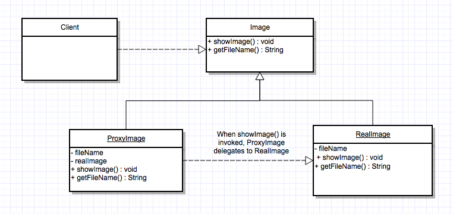

# proxy_design_pattern

#Intent

Provide a surrogate or placeholder for another object to control access to it.

Also known as "Surrogate".

#Motivation

One reason for controlling access to an object is to defer the full cost of its creation and initialization until we actually need to use it.  The solution is to use another object, a proxy, that acts as a stand-in for the real object.  The proxy acts just like the real object and takes care of instantiating it when it's required.

#Applicablility

Proxy is applicable whenever there is a need for a more versatile or sophisticated reference to an object other than a simple pointer.

Common situations in which the Proxy Pattern is applicable:

1) remote proxy = provides a local representative for an object in a different address space.

2) virtual proxy creates expensive objects on demand.

3) protection proxy = controls access to the original object (useful when objects should have different access rights).

4) smart reference = replacement for a bare pointer that performs additional actions when an object is accessed.

#Problem solved in example

The proxy pattern is meant to solve the problem of obtaining expensive or difficult to obtain instances of objects when they are required.  It completes this by using a proxy object that has the minimal information the client needs and delaying the expensive action until it is aboslutely required.

To demonstrate this, this demo has 3 main classes.

1) The Client class (which is responsible for creating the Proxy objects and asking for basic information and then expensive information)

2) The RealImage class (which is the actual image object, the expensive one)

3) The ProxyImage class (which is the proxy class that acts as an in between class between the client and the RealImage)

When the program starts, the client creates several ProxyImage classes and then requests basic information from them.  The Proxy classes can provide this basic information (via getFileName() method) without instantiating the RealImage class (which they contain the reference to).  When the client finally asks for the RealImage object (via showImage() method), the proxy instantiates this for the client.